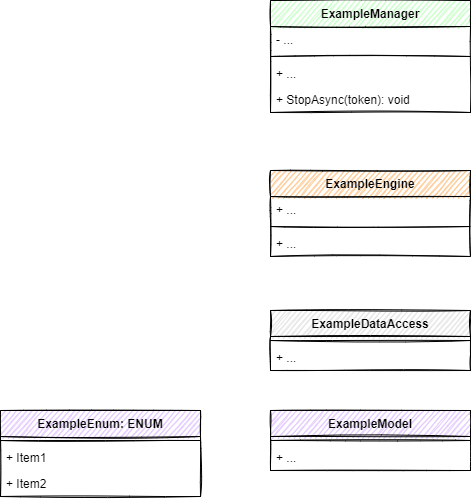

[<< Back](./design.md)

# Class Diagrams & ERDs

## Managers
### IExampleManager
A description of the example manager.

**+ ExamplePublicFunc<type>(someVariable: string): returnType**

A description for the example public function.

## Engines
### IExampleEngine
A description of the example engine.

**+ ExamplePublicFunc<type>(someVariable: string): returnType**

A description for the example public function.

## Data Access
### IExampleDataAccess
A description of the example data access.

**+ ExamplePublicFunc<type>(someVariable: string): returnType**

A description for the example public function.

## Models
### Model1
Model 1 description

[<< Back](./design.md)