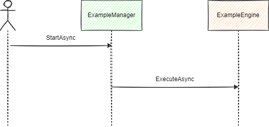

[<< Back](./design.md)

# Sequences
## Example Sequence

- The entry point to the application is **StartAsync** on the **ExampleManager**.
  - **FOR EACH** type implementing the `IEngine` interface,
    - Call **ExecuteAsync** on the `IEngine` instance.

[<< Back](./design.md)