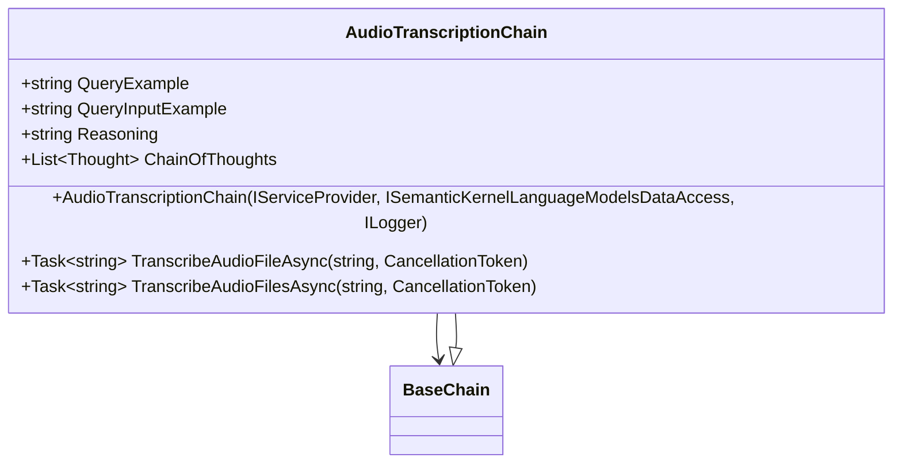
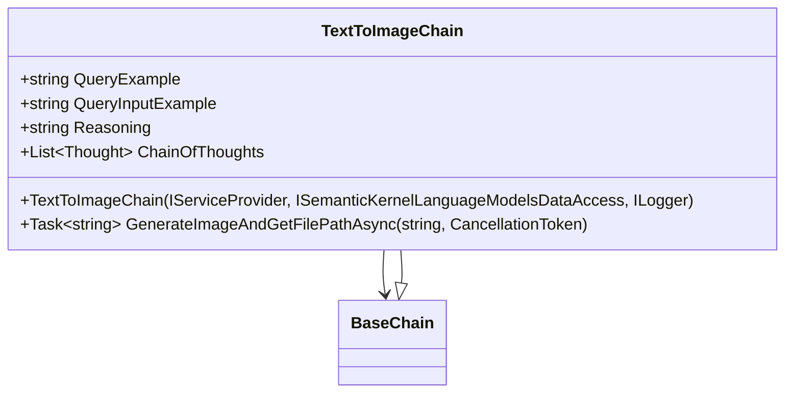
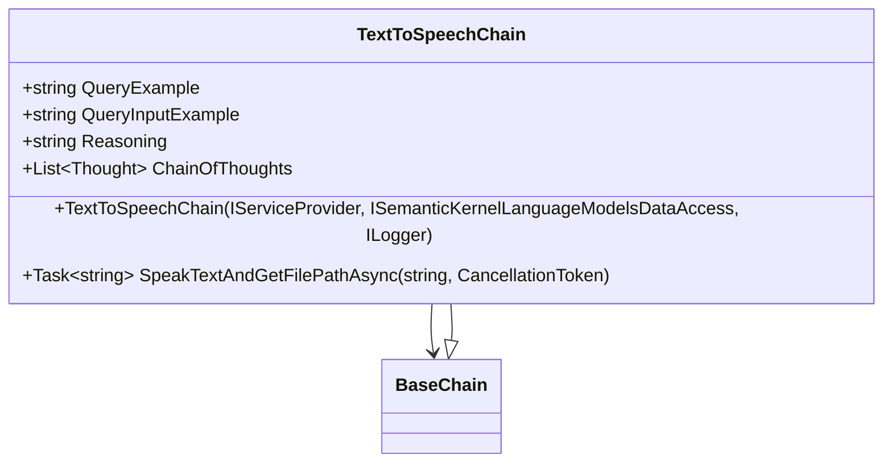
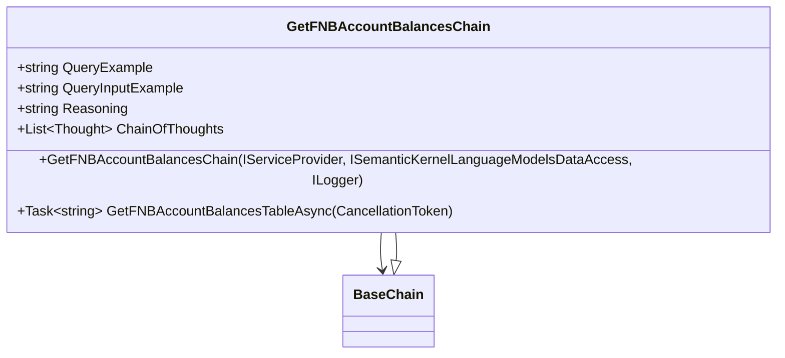
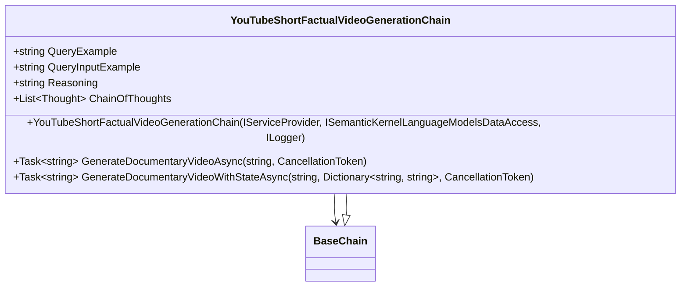

# fa.libraries.dotnet
## Description
This is a collection of FrostAura libraries written for dotnet core 7+. Documentation pending.
## Status
| Project | Status | Platform
| --- | --- | --- |
| FrostAura.Libraries.* |  | GitHub Actions

## NuGet Packages
| Project | Nuget |
| --- | --- |
| FrostAura.Libraries.Core |  |
| FrostAura.Libraries.Data |  |
| FrostAura.Libraries.Finance |  |
| FrostAura.Libraries.Http |  |
| FrostAura.Libraries.Security.OAuth |  |
| FrostAura.Libraries.Semantic.Core |  |

## Documentation
| Content | Description
| -- | -- |
| [Repo Structure](.docs/repo_structure.md) | The structuring of the repo.
| [Design](.docs/design.md) | The software architecture diagram(s) and design(s).
| [Workflow](.docs/workflow.md) | The software automated software pipeline(s).
| [Support & Contribute](.docs/support_contribute.md) | Basic queries, constributing to the repo and supporting the team(s) working on this open-source repo.

## Mermaid Diagrams
### AudioTranscriptionChain

### TextToImageChain

### TextToSpeechChain

### GetFNBAccountBalancesChain

### YouTubeShortFactualVideoGenerationChain

